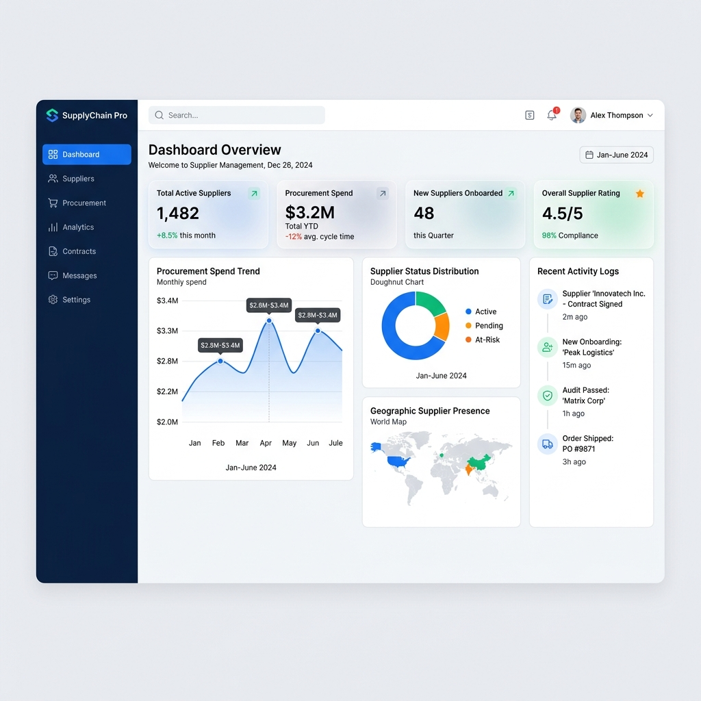
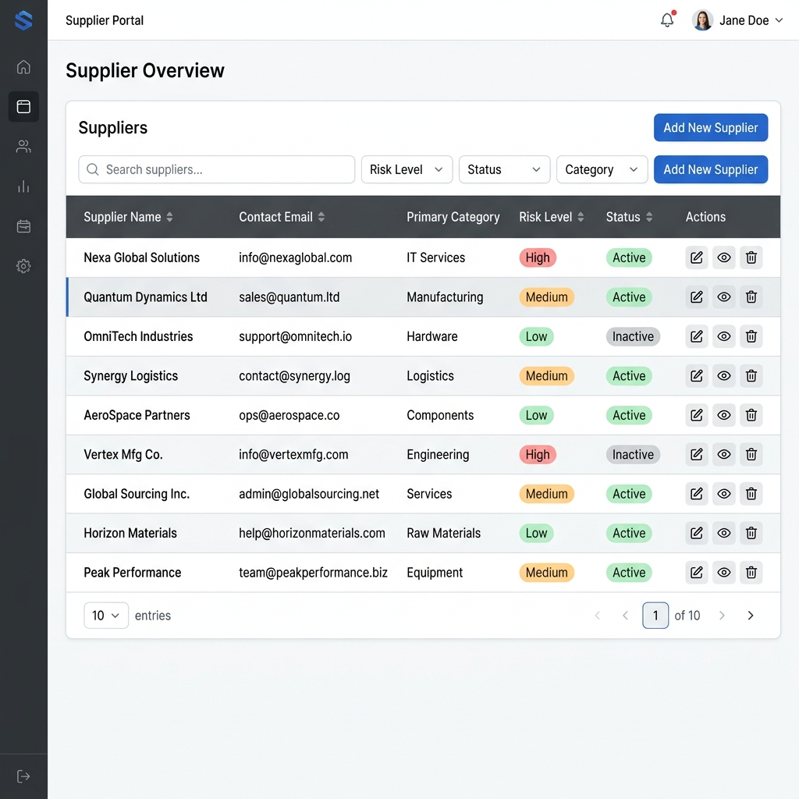
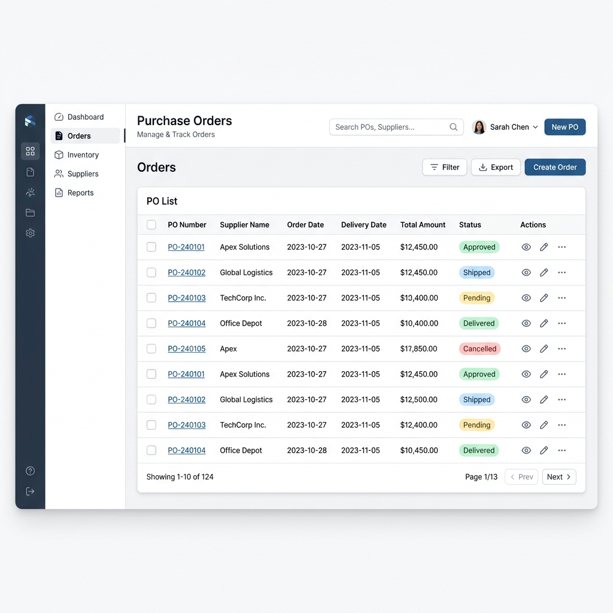

# SupplierHub

Enterprise Supplier Management Platform built with **ASP.NET Core 10**, **React**, **Entity Framework Core**, and **PostgreSQL (Neon)**.

SupplierHub centralizes supplier onboarding, procurement workflows, catalog management, purchase orders, compliance tracking, logistics, quality inspections, invoicing, role-based access control, and audit logging into a single platform.

---

## 🚀 Live Deployment

- **Frontend (Vercel)**: [https://supplierhub.vercel.app](https://supplierhub.vercel.app)
- **Backend API (Render)**: [https://supplierhub.onrender.com](https://supplierhub.onrender.com)
- **Database (Neon)**: [Neon Dashboard - Spring Mouse](https://console.neon.tech/app/projects/spring-mouse-97310562)

---

## Features

### Supplier Management
- Supplier onboarding and registration
- Supplier contact management
- Supplier risk assessment
- Supplier KPI tracking
- Performance scorecards

### Procurement
- Purchase requisitions
- RFx management
- Purchase order creation
- Purchase order acknowledgements
- Purchase order revisions

### Catalog & Inventory
- Product catalogs
- Catalog item management
- Item categorization
- Supplier catalog integration

### Compliance & Contracts
- Compliance document management
- Contract lifecycle management
- Approval workflows
- Audit tracking

### Logistics
- Shipment management
- Delivery tracking
- Goods Receipt Notes (GRN)
- Notifications and alerts

### Quality Assurance
- Inspection workflows
- Non-Conformance Reports (NCR)
- Supplier quality monitoring

### Security
- JWT Authentication
- Role-Based Access Control (RBAC)
- Permission Management
- Audit Logging

---

## Tech Stack

### Backend

- ASP.NET Core 10
- Entity Framework Core
- PostgreSQL (Neon Serverless)
- AutoMapper
- JWT Authentication
- Repository Pattern
- Service Layer Architecture

### Frontend

- React
- TypeScript
- Vite
- Axios
- React Router

---

## Project Structure

```text
SupplierHub
│
├── supplierhub-frontend
│   ├── src
│   ├── public
│   └── package.json
│
├── Supplierhub-backend
│   ├── Controllers
│   ├── Services
│   ├── Repositories
│   ├── Models
│   ├── DTOs
│   ├── Middleware
│   ├── Migrations
│   └── Program.cs
│
└── README.md
```

---

## Architecture

The backend follows a layered architecture:

```text
Controllers
      │
      ▼
Services
      │
      ▼
Repositories
      │
      ▼
Database
```

### Layers

#### Controllers
Handle HTTP requests and responses.

#### Services
Contain business logic and validation.

#### Repositories
Manage database operations.

#### Database
Stores suppliers, procurement records, compliance documents, contracts, and user information in a fully managed PostgreSQL environment.

---

## Authentication Flow

```text
User Login
     │
     ▼
JWT Token Generated
     │
     ▼
Client Stores Token
     │
     ▼
Token Sent In Headers
     │
     ▼
Protected API Access
```

---

## API Modules

### Supplier Module

```http
GET    /api/suppliers
GET    /api/suppliers/{id}
POST   /api/suppliers
PUT    /api/suppliers/{id}
DELETE /api/suppliers/{id}
```

### Purchase Order Module

```http
GET    /api/purchaseorders
POST   /api/purchaseorders
PUT    /api/purchaseorders/{id}
DELETE /api/purchaseorders/{id}
```

### Requisition Module

```http
GET    /api/requisitions
POST   /api/requisitions
```

### Contract Module

```http
GET    /api/contracts
POST   /api/contracts
```

### Authentication Module

```http
POST /api/auth/login
POST /api/auth/register
```

---

## Database Configuration

Update the connection string in your backend's `appsettings.json` or Environment Variables to connect to PostgreSQL:

```json
{
  "ConnectionStrings": {
    "AppDb": "Host=ep-YOUR-ENDPOINT.us-east-1.aws.neon.tech;Database=neondb;Username=YOUR_USER;Password=YOUR_PASSWORD;SSL Mode=Require;Trust Server Certificate=true"
  }
}
```

---

## Backend Setup

### Clone Repository

```bash
git clone https://github.com/kalyan-reddy-b/SupplierHub.git
cd SupplierHub
```

### Navigate to Backend

```bash
cd Supplierhub-backend
```

### Restore Packages

```bash
dotnet restore
```

### Run Backend

*(Note: Migrations run automatically on startup via `context.Database.MigrateAsync()`)*
```bash
dotnet run
```

Backend will start at:

```text
http://localhost:5181
```

---

## Frontend Setup

### Navigate to Frontend

```bash
cd supplierhub-frontend
```

### Install Dependencies

```bash
npm install
```

### Start Development Server

```bash
npm run dev
```

Frontend will start at:

```text
http://localhost:5173
```

---

## Environment Variables

### Backend (.env or Render Settings)

```env
JWT__KEY=064e5393-68c8-4570-b86a-0eccd04f7b7b
JWT__ISSUER=SupplierHubAPI
JWT__AUDIENCE=SupplierHubClient
ConnectionStrings__AppDb=<YOUR_NEON_CONNECTION_STRING>
ASPNETCORE_HTTP_PORTS=10000
```

### Frontend (.env)

```env
VITE_API_BASE_URL=https://supplierhub.onrender.com/api
```

*(For local development, change this to `http://localhost:5181/api`)*

---

## Screenshots

### Dashboard


### Supplier Management


### Purchase Orders


---

## Key Highlights

- Enterprise-style architecture
- JWT-based authentication
- Role-based access control
- Repository pattern implementation
- Service-oriented design
- Entity Framework Core integration
- Modular backend structure
- Scalable procurement workflows
- Audit logging support
- Supplier performance management

---

## License

This project is intended for educational and portfolio purposes.
